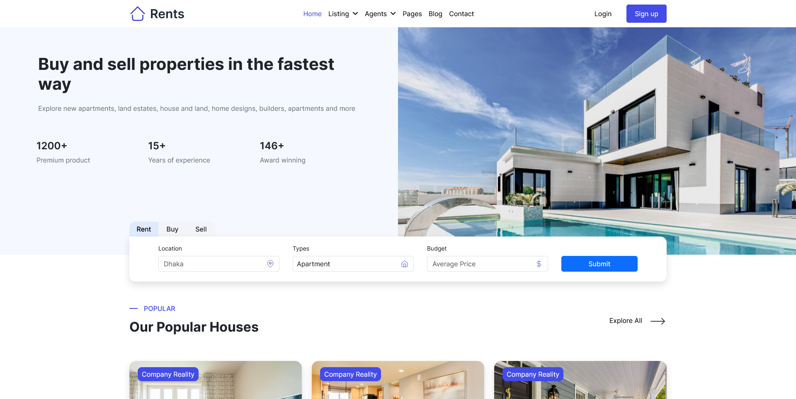

# Rents

Rents is a web project created using HTML, SCSS, and Bootstrap 5.

This project was created and completed in March 2023

## Live Demo

Explore the live demo of Rents at [jonas-beck.github.io/Rents](https://jonas-beck.github.io/Rents).

## Overview

Rents is a web project developed with a focus on the use of SCSS and Bootstrap 5 for styling. The project is based on a provided design, which can be seen in Design folder.
